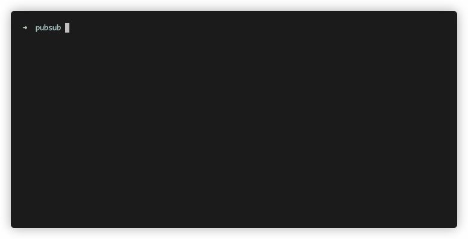

# Google Pub/Sub Node.js Framework

[](https://www.npmjs.com/package/@honestfoodcompany/pubsub)
[](https://github.com/deliveryhero/hfc-pubsub/actions/workflows/build.yml)
[](https://www.codacy.com?utm_source=github.com&utm_medium=referral&utm_content=deliveryhero/hfc-pubsub&utm_campaign=Badge_Grade)
[](https://www.codacy.com?utm_source=github.com&utm_medium=referral&utm_content=deliveryhero/hfc-pubsub&utm_campaign=Badge_Coverage)

This package contains a lightweight framework and subscription server for [Google Pub/Sub](https://cloud.google.com/pubsub). It was created to speed up development time and it provides a common foundation for building event driven applications. It lets developers define topics and subscriptions simply and declaratively, while additionally offering a simple subscription server to run all of a project's subscription handlers.

- [Docs](https://deliveryhero.github.io/hfc-pubsub/)
- [Changelog](https://deliveryhero.github.io/hfc-pubsub/interfaces/changelog/)



## Table of Contents

- [Google Pub/Sub Node.js Framework](#google-pubsub-nodejs-framework)

  - [Table of Contents](#table-of-contents)
  - [Features](#features)
  - [Getting started](#getting-started)
  - [Required Environment Variables](#required-environment-variables)
  - [CLI commands - starting and listing subscriptions](#cli-commands---starting-and-listing-subscriptions)
  - [Topics](#topics)
    - [Publishing a message (simple example)](#publishing-a-message-simple-example)
      - [Typescript example](#typescript-example)
      - [Javascript example](#javascript-example)
    - [Publishing a message with retry settings](#publishing-a-message-with-retry-settings)
    - [Publishing on a different GCP project](#publishing-on-a-different-gcp-project)
  - [Subscriptions](#subscriptions)
    - [Typescript subscription example](#typescript-subscription-example)
    - [Javascript subscription example](#javascript-subscription-example)
    - [Subscription example with subscriber options](#subscription-example-with-subscriber-options)
    - [Subscription with a Dead-letter Policy](#subscription-with-a-dead-letter-policy)
      - [Binding Subscriber and Publisher role to Dead Letter](#binding-subscriber-and-publisher-role)
    - [Subscription with Retry Policy](#subscription-with-retry-policy)
    - [Subscription with Message Ordering](#subscription-with-message-ordering)
  - [Subscriber Options](#subscriber-options)
  - [Subscription Service](#subscription-service)
    - [Typescript example](#typescript-example-1)
    - [Javascript Example](#javascript-example-1)
    - [Graceful Shutdown](#graceful-shutdown)
    - [Connecting to a database](#connecting-to-a-database)
  - [Enabling Synchronous Driver](#enabling-synchronous-driver)
  - [Enabling gRPC C++ bindings](#enabling-grpc-c-bindings)

## Features

1. Run all of your subscriptions at once with a subscription server
2. Define pub/sub subscriptions and topics in a declarative way
3. Define your subscription handlers with a simple object
4. Get started quickly: define a topic and publish messages with a few lines of code

## Getting started

The framework expects that you've created a pubsub directory in your project with the following structure:

<pre>
| .env        <-- this should be in your project root directory
| - pubsub/    <-- this can be anywhere (defined in .env as PUBSUB_ROOT_DIR)
|   | - subscriptions/
|   | - topics/
</pre>

1. Once the directory structure has been defined, [environment variables should be set](#required-environment-variables).
2. Then you can create [subscriptions](#subscriptions) and [topics](#topics)
3. After a subscription has been created, use the [CLI](#cli-commands---starting-and-listing-subscriptions) to start the subscriptions server.
4. Initialize your database connection, define project-level subscription defaults, and register subscriptions in the [Subscription Service](#subscription-service).

## Required Environment Variables

The framework expects the following environment variables. They can be added the `.env` file.

```ini
GOOGLE_APPLICATION_CREDENTIALS=/path/to/gcp-project-83d5537a8388-key.json
GOOGLE_CLOUD_PUB_SUB_PROJECT_ID=gcp-project-id
PUBSUB_ROOT_DIR=/path/to/your/pubsub/directory # this can be a relative path
```

| Variable                          | Description                                                                                                                                                                                                                      |
| --------------------------------- | -------------------------------------------------------------------------------------------------------------------------------------------------------------------------------------------------------------------------------- |
| `PUBSUB_ROOT_DIR`                 | must be the path to your project's pubsub directory. This module only works with .js files, so if you are writing your code in typescript, you must set this variable to the pubsub directory in your project's build directory. |
| `GOOGLE_APPLICATION_CREDENTIALS`  | see <https://cloud.google.com/docs/authentication/getting-started#creating_a_service_account> to generate this                                                                                                                   |
| `GOOGLE_CLOUD_PUB_SUB_PROJECT_ID` | name of the project in Google Cloud Platform                                                                                                                                                                                     |
| `PROJECT_NUMBER` (Optional)       | Project for binding DLQ roles. Check [Binding Subscriber and Publisher role](#binding-subscriber-and-publisher-role) for more details. If Not provided GOOGLE_CLOUD_PUB_SUB_PROJECT_ID is used to fetch the PROJECT_NUMBER       |

## CLI commands - starting and listing subscriptions

Prerequisites: Install npx if you don't have it installed yet: `npm i -g npx`

| Command                   | Description                  |
| ------------------------- | ---------------------------- |
| `npx subscriptions start` | starts project subscriptions |
| `npx subscriptions list`  | lists project subscriptions  |

> Alternatively the CLI can be found at `./node_modules/.bin/subscriptions`

### Usage with Typescript

For use with Typescript, update your local `PUBSUB_ROOT_DIR` env var to the src directory of the project with the typescript files.

And instead of using `npx subscriptions start` you can invoke the bin script with [ts-node](https://github.com/TypeStrong/ts-node/):

```sh
npx ts-node ./node_modules/.bin/subscriptions start
```

If you have a separate `tsconfig` for your server code then you should pass it to `ts-node`:

```sh
npx ts-node --project tsconfig.server.json ./node_modules/.bin/subscriptions start
```

To make this easier you can add a script in your `package.json`:

```json
{
  "scripts": {
    "pubsub": "ts-node ./node_modules/.bin/subscriptions start"
  }
}
```

#### Use Debugger with Typescript

`ts-node` doesn't have an `--inspect` option unlike the `node` cli. But we can still pass it to the node process by way of the `NODE_OPTIONS` env var.

```sh
NODE_OPTIONS='--inspect' ts-node --project tsconfig.server.json  ./node_modules/.bin/subscriptions start
```

#### Watch Mode with Typescript

You can use `nodemon` in combination with `ts-node` to develop in watch mode:

```json
{
  "scripts": {
    "pubsub": "nodemon --exec \"NODE_OPTIONS='--inspect' ts-node --project tsconfig.server.json ./node_modules/.bin/subscriptions start\""
  }
}
```

## Topics

Create a topic in `PUBSUB_ROOT_DIR/topics` which extends `Topic` and a payload which extends `BasePayload`

```typescript
// PUBSUB_ROOT_DIR/topics/simple.topic.name.ts
import { Topic, Payload as BasePayload } from '@honestfoodcompany/pubsub';

export default class SimpleTopic extends Topic {
  readonly name = 'simple.topic.name';
}

export interface Payload extends BasePayload {
  id: number;
  data: string;
}
```

> As a convention, the name of the topic file should match the name of the topic name so the file directory becomes self-documenting.

### Publishing a message (simple example)

If a topic does not exist, it will be created before a message is published.

#### Typescript example

```typescript
// client.example.ts
import SimpleTopic, { Payload } from 'PUBSUB_ROOT_DIR/topics/simple.topic.name';

new SimpleTopic().publish<Payload>({ id: 1, data: 'My first message' });
```

#### Javascript example

```typescript
// client.example.ts
import SimpleTopic from 'PUBSUB_ROOT_DIR/topics/simple.topic.name';

new SimpleTopic().publish({ id: 1, data: 'My first message' });
```

### Publishing a message with retry settings

> NOTE: This may not work right now

see [Sample Topic with Retry Settings](https://github.com/honest-food-company/pubsub/tree/master/examples/typescript/test.topic.withRetrySettings.ts) for defining a default retry policy

```typescript
// client.example.ts
import SimpleTopic, { Payload } from 'pubsub/topics/simple.topic.name';

let topic = new SimpleTopic();
topic.publish<Payload>(
  { id: 1, data: 'My first message' },
  {
    retryCodes: [10, 1],
    backoffSettings: {
      initialRetryDelayMillis: 100,
    },
  },
);
```

### Publishing on a different GCP project

see [Sample Topic using its own GCP Project](https://github.com/honest-food-company/pubsub/tree/master/__tests__/pubsub/topics/example.topic_withProjectCredentials.ts)

### Publishing with Attributes

See: <https://cloud.google.com/pubsub/docs/publisher#using_attributes>

```typescript
// client.example.ts
import SimpleTopic, { Payload } from 'pubsub/topics/simple.topic.name';

let topic = new SimpleTopic();
topic.publish<Payload>(
  { id: 1, data: 'My first message' },
  {
    attributes: {
      filter: 'a',
      company: 'b',
      status: 'failed',
    },
  },
);
```

These attributes can then be used to filter messages using the `filter` option in Subscription Options.

## Subscriptions

Create a `Subscriber` to define a message handler for messages that are published on the corresponding topic.

Subscribers are contained in `PUBSUB_ROOT_DIR/subscriptions`.

> Files ending in `.sub.js` in `PUBSUB_ROOT_DIR/subscriptions` will be autoloaded by the subscription server.

### Typescript subscription example

```typescript
// PUBSUB_ROOT_DIR/subscriptions/simple.topic.name.console-log.sub.ts
import { SubscriberObject, Message } from "@honestfoodcompany/pubsub"; // this import is optional, it's gives us the interfaces to use below

export default: SubscriberObject = {
  topicName: 'simple.topic',
  subscriptionName: 'simple.topic.console-log.sub',
  description: 'Will console log messages published on test.topic',

  handleMessage: function(message: Message): void {
    console.log(this.subscriptionName, 'received message');
    console.log(message.data.toString());
    message.ack();
  },
};

```

### Javascript subscription example

```javascript
// PUBSUB_ROOT_DIR/subscriptions/simple.topic.name.sub.js
exports.default = {
  topicName: 'test.topic',
  subscriptionName: 'test.topic.sub',
  description: 'Will console log messages published on test.topic',

  handleMessage: function (message) {
    console.log(this.subscriptionName, 'received message');
    console.log(message.data.toString());
    message.ack();
  },
};
```

### Subscription example with [subscriber options](#subscriber-options)

```javascript
// PUBSUB_ROOT_DIR/subscriptions/simple.topic.name.subscription.js
exports.default = {
  topicName: 'test.topic',
  subscriptionName: 'test.topic.subscription',
  description: 'Will console log messages published on test.topic',
  options: {
    flowControl: {
      maxMessages: 500, // max messages in progress
    },
  },
  handleMessage: function (message) {
    console.log(`received a message on ${this.subscriptionName}`);
    console.log(message.data.toString());
    message.ack();
  },
};
```

### Subscription with a Dead-letter Policy

It is possible to define a dead-letter policy for a subscription. If the dead letter topic does not exist, it will be created automatically by the framework. There needs to be a `PROJECT_NUMBER` defined for dead letter to pick up publisher, subscriber role or we use the Project ID to fetch it. `createDefaultSubscription` will create a default dead letter subscription with name having `.default` added to `deadLetterTopic`. Check [Binding Subscriber and Publisher role](#binding-subscriber-and-publisher-role) for more details

```javascript
// PUBSUB_ROOT_DIR/subscriptions/simple.topic.sub.js
exports.default = {
  topicName: 'test.topic',
  subscriptionName: 'test.topic.sub',
  description: 'Will console log messages published on test.topic',
  options: {
    deadLetterPolicy: {
      deadLetterTopic: 'test.deadletter.topic',
      maxDeliveryAttempts: 15,
      createDefaultSubscription: true,
    },
  },
  handleMessage: function (message) {
    console.log(`received a message on ${this.subscriptionName}`);
    console.log(message.data.toString());
  },
};
```

### Binding Subscriber and Publisher role

To automatically have a Publisher,Subscriber role attached to your dead letters you need to add `PROJECT_NUMBER` in the env list. If this `PROJECT_NUMBER` isn't available in env then it'll use `GOOGLE_CLOUD_PUB_SUB_PROJECT_ID` to fetch it.
Binding the above policies don't require current subscriptions to be deleted.

To find out project number through CLI use the commands below:

- `PROJECT=$(gcloud config get-value project)`
- `gcloud projects list --filter="$PROJECT" --format="value(PROJECT_NUMBER)"`

### Subscription with Retry Policy

It is possible to define a retry configuration for a subscription:

```javascript
// PUBSUB_ROOT_DIR/subscriptions/simple.topic.name.subscription.sub.js
exports.default = {
  topicName: 'test.topic',
  subscriptionName: 'test.topic.sub',
  description: 'Will console log messages published on test.topic',
  options: {
    retryPolicy: {
      minimumBackoff: { seconds: 20, nanos: 20 },
      maximumBackoff: { seconds: 400, nanos: 2 },
    },
  },
  handleMessage: function (message) {
    console.log(`received a message on ${this.subscriptionName}`);
    console.log(message.data.toString());
  },
};
```

### Subscription with Message Ordering

Messages published with the same `ordering_key` in `PubsubMessage` will be delivered to the subscribers in the order in which they are received by the Pub/Sub system.

```javascript
// PUBSUB_ROOT_DIR/subscriptions/simple.topic.name.subscription.sub.js
exports.default = {
  topicName: 'test.topic',
  subscriptionName: 'test.topic.sub',
  description: 'Will console log messages published on test.topic',
  options: {
    enableMessageOrdering: true,
  },
  handleMessage: function (message) {
    console.log(`received a message on ${this.subscriptionName}`);
    console.log(message.data.toString());
  },
};
```

## Subscriber Options

[Usage Example](#subscription-example-with-subscriber-options)

```typescript
interface SubscriberOptions {
  /**
   * override the default project settings from the environment variable
   * and use the project defined here instead for the subscription
   **/
  project?: {
    id: string;
    credentials: {
      client_email?: string;
      private_key?: string;
    };
  };

  /**
   * in seconds
   **/
  ackDeadline?: number;

  batching?: {
    callOptions?: CallOptions; // see https://github.com/googleapis/gax-nodejs/blob/77f16fd2ac2f1bd90cc6abfcccafa94a20582017/src/gax.ts#L114
    maxMessages?: number;
    maxMilliseconds?: number;
  };
  flowControl?: {
    allowExcessMessages?: boolean;
    maxBytes?: number;
    maxExtension?: number;
    maxMessages?: number;
  };
  streamingOptions?: {
    highWaterMark?: number;
    maxStreams?: number;
    timeout?: number;
  };
  deadLetterPolicy?: {
    deadLetterTopic: string;
    maxDeliveryAttempts: number;
  };
  retryPolicy?: {
    minimumBackoff: { seconds: number; nanos?: number }; // "10s"-"599s"
    maximumBackoff: { seconds: number; nanos?: number }; // "11s"-"600s"
  };

  /**
   *   An expression written in the Pub/Sub [filter
   *   language](https://cloud.google.com/pubsub/docs/filtering). If non-empty,
   *   then only `PubsubMessage`s whose `attributes` field matches the filter are
   *   delivered on this subscription. If empty, then no messages are filtered
   *   out.
   * */
  filter?: string;

  /**
   *   If true, messages published with the same `ordering_key` in `PubsubMessage`
   *   will be delivered to the subscribers in the order in which they
   *   are received by the Pub/Sub system. Otherwise, they may be delivered in
   *   any order.
   */
  enableMessageOrdering?: boolean;
}
```

## Subscription Service

Extend and customize the behavior of the subscription server in the subscription service file. Initialize a database connection, register subscribers, and define default subscriber options in the subscription service file.

### Typescript example

```ts
// PUBSUB_ROOT_DIR/subscription.service.ts
import * as PubSub from '@honestfoodcompany/pubsub';
import { SubscriberOptions } from '@honestfoodcompany/pubsub';

export default class SubscriptionService extends PubSub.SubscriptionService {
  static subscribers = [
    /**
     * if your subscribers don't have the .sub.js suffix
     * they won't be auto-loaded,  so you can include their default
     * export in  this array
     */
  ];

  static defaultSubscriberOptions: SubscriberOptions = {
    /**
     * Define project level default subscriber options here.
     * These options can be overridden by options defined in subscribers
     */
  };

  static async init(): Promise<void> {
    /**
     * This function is called when the subscription server starts.
     * This is a good place to initialize a database connection
     */
  }
}
```

### Javascript Example

```javascript
// PUBSUB_ROOT_DIR/subscription.service.js
const PubSub = require('@honestfoodcompany/pubsub');

class SubscriptionService extends PubSub.SubscriptionService {}

SubscriptionService.subscribers = [
  /**
   * if your subscribers don't have the .sub.js suffix
   * they won't be auto-loaded,  so you can include their default
   * export in  this array
   */
];

SubscriptionService.defaultSubscriberOptions = {
  /**
   * Define project-level default subscriber options here.
   * These options can be overridden by options defined in subscribers
   */
};

SubscriptionService.init = () => {
  /**
   * This function is called when the subscription server starts.
   * This is a good place to initialize a database connection
   */
};

exports.default = SubscriptionService;
```

### Connecting to a database

It is recommended to initialize a database connection in the `subscription.service` file in your `PUBSUB_ROOT_DIR`. Insert your database connection logic in the `init` method.

see: [Subscription Service](#subscription-service) for more details

### Graceful Shutdown

When gracefully shutting down a process, it is a good idea to first close all open subscriptions. For this reason we have a static `closeAll` method in the `SubscriptionService` that can close all connections before shutting down. An example using it with process signal handlers:

```ts
// PUBSUB_ROOT_DIR/subscription.service.js
import * as PubSub from '@honestfoodcompany/pubsub';
import mongoose from 'mongoose';
import { SubscriberOptions } from '@honestfoodcompany/pubsub';

export default class SubscriptionService extends PubSub.SubscriptionService {
  static subscribers = [
    /**
     * if your subscribers don't have the .sub.js suffix
     * they won't be auto-loaded,  so you can include their default
     * export in  this array
     */
  ];

  /**
   * This function is called when the subscription server starts.
   */
  static async init(): Promise<void> {
    /**
     * This is a good place to initialize a database connection
     */
    await mongoose.connect();
  }
}

/**
 * Example setting up graceful shutdown
 */
process.on('SIGTERM', () => {
  // First close all subscriptions
  SubscriptionService.closeAll()
    .then(() => {
      // Then the databse so no new handlers are triggered
      mongoose.disconnect(() => {
        process.exit(0);
      });
    })
    .catch((err) => {
      console.error(err, 'Could not close subscriptions');
      process.exit(1); // Exit with error
    });
});
```

## Enabling Synchronous Driver

If you would like to bypass Google PubSub and run your subscriptions synchronously (for development purposes) set the following environment variable:

`PUBSUB_DRIVER=synchronous`

## Enabling gRPC C++ bindings

For some workflows and environments it might make sense to use the C++ gRPC implementation, instead of the default one. To configure the module to use an alternative grpc transport use the following environment variable:

```shell
PUBSUB_USE_GRPC=true
```
