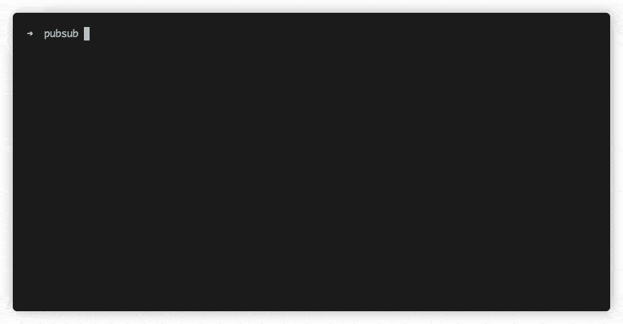

# Google Pub/Sub Node.js Framework

This package contains a lightweight framework and subscription server for [Google Pub/Sub](https://cloud.google.com/pubsub). It was created to speed up development time and it provides a common foundation for building event driven applications. It lets developers define topics and subscriptions simply and declaratively, while additionally offering a simple subscription server to run all of a project's subscription handlers.

- [Docs](https://deliveryhero.github.io/hfc-pubsub/)
- [Changelog](https://deliveryhero.github.io/hfc-pubsub/changelog)

## Table of Contents

- [Google Pub/Sub Node.js Framework](#google-pubsub-nodejs-framework)

  - [Table of Contents](#table-of-contents)
  - [Features](#features)
  - [Getting started](#getting-started)
  - [CLI commands - starting and listing subscriptions](#cli-commands---starting-and-listing-subscriptions)
  - [Topics](#topics)
  - [Subscriptions](#subscriptions)
  - [Subscription Service](#subscription-service)
  - [Enabling Synchronous Driver](#enabling-synchronous-driver)
  - [Enabling gRPC C++ bindings](#enabling-grpc-c-bindings)

## Features

1. Run all of your subscriptions at once with a subscription server
2. Define pub/sub subscriptions and topics in a declarative way
3. Define your subscription handlers with a simple object
4. Get started quickly: define a topic and publish messages with a few lines of code

## Getting started

Moved to [Docs](https://deliveryhero.github.io/hfc-pubsub/)

## CLI commands - starting and listing subscriptions

Moved to [CLI](https://deliveryhero.github.io/hfc-pubsub/cli)

## Topics

Moved to [Topics](https://deliveryhero.github.io/hfc-pubsub/topics)

## Subscriptions

Moved to [Subscriptions](https://deliveryhero.github.io/hfc-pubsub/subscriptions)

## Subscription Service

Moved to [Service](https://deliveryhero.github.io/hfc-pubsub/service)

## Enabling Synchronous Driver

Moved to [Drivers](https://deliveryhero.github.io/hfc-pubsub/drivers)

## Enabling gRPC C++ bindings

Moved to [Options](https://deliveryhero.github.io/hfc-pubsub/options)
